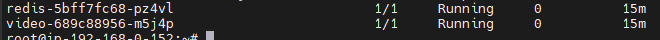

# Cluster Migration Guide
This guide provides a structured approach for migrating both stateless and stateful workloads across Kubernetes clusters. The migration mechanism leverages container checkpointing, a management-plane migration operator, and a node-level checkpoint agent to capture and restore running application state.
The documentation is organized into two main parts:

1. **Installation and Infrastructure Setup**: Covers environment prerequisites, cluster preparation, operator deployment, and storage/network configuration requirements.
2. **Testing procedure**: Demonstrates how to trigger a migration, verify checkpoint and restore steps, and evaluate service continuity during failover or planned transitions.

# I. Installation and Infrastructure Setup

## 1. Overview

- Management plane runs controllers on the management cluster.
- Workload plane runs the checkpoint-agent on source worker nodes.
- Storage and network configuration must match between source and target for successful restoration.

> Important: Source and destination clusters must run identical versions of kubelet, containerd, CRIU, and runc.

---

## 2. Prerequisites

- Kubernetes >= 1.30 on all clusters
- containerd >= 2.1.4 on all nodes
- CRIU >= 4.1.1 on worker nodes
- runc version aligned across all nodes (exact same version)
- Go >= 1.23 on all relevant hosts
- Helm installed on the management cluster
- clusterctl available on the management cluster
- Access to container registry and credentials
- Access to a Git server for package sources (for example, Gitea)
- Access to a MinIO or S3-compatible object store for checkpoints

---

## 3. Package variants to keep when creating workload clusters


---

## 4. Cluster naming and environment

- Azure clusters: Replace occurrences of the word "example" with the actual cluster name, for example, cluster1-azure.


- Set environment variables to match the cloud account you are using (Azure or AWS). Keep provider-specific CIDRs and network settings consistent with your cloud resources.

---

## 5. Management Cluster Setup

### 5.1 Initialize providers and tooling

```bash
clusterctl init --infrastructure azure
snap install helm --classic
apt install -y buildah
mkdir -p /var/lib/kubelet/checkpoints # where the controller will access checkpoints if needed
```

### 5.2 Use Flannel CNI

All clusters here are configured with Pod CIDR 10.244.0.0/16.

```bash
kubectl apply -f https://github.com/flannel-io/flannel/releases/latest/download/kube-flannel.yml --kubeconfig <kubeconfig-file>
```

- Note: By default, CAPI resources often use Pod CIDR 192.168.0.0/16. Ensure this matches your Flannel config.

### 5.3 Azure cloud controller for Flannel

For Azure, install the cloud provider controller and set a matching clusterCIDR. Adjust if your actual pod CIDR differs.

```bash
helm install --repo https://raw.githubusercontent.com/kubernetes-sigs/cloud-provider-azure/master/helm/repo cloud-provider-azure --generate-name --set infra.clusterName=${CLUSTER_NAME} --set cloudControllerManager.clusterCIDR="10.244.0.0/16" --kubeconfig <kubeconfig-file> 

```

---

## 6. Prepare Worker Nodes (source and destination)

### 6.1 Install CRIU and align runc

```bash
curl -fsSL https://download.opensuse.org/repositories/devel:/tools:/criu/xUbuntu_22.04/Release.key | gpg --dearmor -o /etc/apt/trusted.gpg.d/criu.gpg
echo "deb http://download.opensuse.org/repositories/devel:/tools:/criu/xUbuntu_22.04/ ./" | tee /etc/apt/sources.list.d/criu.list
apt-get update
apt-get install criu -y


# upgrade runc
cd /tmp
curl -L -o runc.new https://github.com/opencontainers/runc/releases/download/v1.3.1/runc.amd64
mv /tmp/runc.new /usr/local/sbin/runc
chmod +x /usr/local/sbin/runc
```

### 6.2 Create /etc/criu/runc.conf

```bash
# /etc/criu/runc.conf
file-locks
tcp-close
skip-in-flight
tcp-established
log-file /tmp/criu.log
enable-external-masters
external mnt[]
skip-mnt /proc/latency_stats
```

### 6.3 Verify runc

Output should be identical across nodes:

```bash
runc --version
# Example output:
# runc version 1.3.1
# commit: v1.3.1-0-ge6457afc
# spec: 1.2.1
# go: go1.23.12
# libseccomp: 2.5.6
```

### 6.4 Enable kubelet feature gate (checkpointing)

```bash
nano /etc/default/kubelet
# Append or merge the following flag (or use your distro's kubelet drop-in)
KUBELET_EXTRA_ARGS="--feature-gates=ContainerCheckpoint=true"
```

Restart kubelet and containerd:

```bash
systemctl restart kubelet containerd
```

---

## 6.5 SSH and Access (optional helpers)

To copy SSH keys from capi to root:

```bash
cp -r /home/capi/.ssh /root/
```

Enable root SSH in /etc/ssh/sshd_config (PermitRootLogin yes), then:

```bash
systemctl restart ssh || service sshd restart
```

VS Code SSH config example:

```
Host azure-bastion-box
    HostName 20.214.25.226
    User capi
    IdentityFile "C:\\Users\\Vt\\Downloads\\azure-vm-test_key.pem"

Host azure-target-box
    HostName 10.1.0.4
    User root
    IdentityFile "C:\\Users\\Vt\\Downloads\\azure-vm-test_key.pem"
    ProxyCommand ssh -q -W %h:%p azure-bastion-box
```

---

## 7. Cloud Setup on Management Cluster (Azure example)

Install Azure CLI:

```bash
curl -sL https://aka.ms/InstallAzureCLIDeb | bash
```

Login:

```bash
az login
```

Create resource group:

```bash
az group create --location koreasouth --resource-group capi-test
```

Create user-assigned identity:

```bash
az identity create \
  --name cloud-provider-user-identity \
  --resource-group capi-test
```

---

## 8. Secrets and Credentials

### 8.1 Gitea credentials secret

```bash
kubectl create secret generic git-user-secret \
  --from-literal=username=nephio \
  --from-literal=password=secret \
  -n default
```

### 8.2 Go installation

Follow the official guide: [https://go.dev/doc/install](https://go.dev/doc/install)

### 8.3 Clone the operator

```bash
mkdir -p ~/projects && cd ~/projects
git clone https://github.com/vitu-mafeni/transition-operator.git
```

### 8.4 Environment variables

MinIO console defaults: username "nephio1234" and password "secret1234".

```bash
# Discover MinIO ports
kubectl get svc -n minio-system

# Example environment variables
export MINIO_ENDPOINT="47.129.115.173:31092"
export MINIO_ACCESS_KEY="nephio1234"
export MINIO_SECRET_KEY="secret1234"
export MINIO_BUCKET="checkpoints"

export REPOSITORY="vitu1"
export SECRET_NAME_REF="reg-credentials"
export SECRET_NAMESPACE_REF="default"
export REGISTRY_URL="docker.io"
export HEARTBEAT_FAULT_DELAY=20

export GIT_SERVER_URL="http://47.129.115.173:31413"
export GIT_SECRET_NAME="git-user-secret"
export GIT_SECRET_NAMESPACE="default"
export POD_NAMESPACE="default"
export REGISTRY_PASSWORD="PUT_PASSWORD_HERE" # Use a Docker Hub access token
```

### 8.5 Create registry credentials secret

```bash
 # Base64 ecredentials
 username_b64=$(echo -n "$REPOSITORY" | base64 -w 0) 
 password_b64=$(echo -n "$REGISTRY_PASSWORD" | base64 -w 0)
 registry_b64=$(echo -n "$REGISTRY_URL" | base64 -w 0) # docker.io
  
# Create secret manifest
  
cat > /tmp/registry-credentials.yaml <<EOF
apiVersion: v1
kind: Secret
metadata:
  name: reg-credentials
type: Opaque
data:
  username: $username_b64
  password: $password_b64
  registry: $registry_b64
EOF

kubectl apply -f /tmp/registry-credentials.yaml
```

- Note: Use a Docker Hub access token rather than your account password.

### 8.6 Service account for checkpoint operations (source cluster)

- source-cluster is the cluster where we will transition from

```bash
cat > /tmp/checkpoint-sa.yaml <<EOF
apiVersion: v1
kind: ServiceAccount
metadata:
  name: checkpoint-sa
  namespace: default
---
apiVersion: rbac.authorization.k8s.io/v1
kind: Role
metadata:
  name: checkpoint-role
  namespace: default
rules:
  - apiGroups: [""]
    resources: ["pods/checkpoint"]
    verbs: ["patch", "create", "update", "proxy"]
  - apiGroups: [""]
    resources: ["serviceaccounts/token"]
    verbs: ["create"]
  - apiGroups: [""]
    resources: ["nodes/proxy"]
    verbs: ["create", "get"]
---
apiVersion: rbac.authorization.k8s.io/v1
kind: RoleBinding
metadata:
  name: checkpoint-rolebinding
  namespace: default
subjects:
  - kind: ServiceAccount
    name: checkpoint-sa
    namespace: default
roleRef:
  kind: Role
  name: checkpoint-role
  apiGroup: rbac.authorization.k8s.io
---
apiVersion: rbac.authorization.k8s.io/v1
kind: ClusterRole
metadata:
  name: checkpoint-sa-nodes-checkpoint
rules:
  - apiGroups: [""]
    resources: ["nodes/checkpoint"]
    verbs: ["create"]
  - apiGroups: [""]
    resources: ["serviceaccounts/token"]
    verbs: ["create"]
  - apiGroups: [""]
    resources: ["nodes/proxy"]
    verbs: ["create", "get"]


---
apiVersion: rbac.authorization.k8s.io/v1
kind: ClusterRoleBinding
metadata:
  name: checkpoint-sa-nodes-checkpoint-binding
subjects:
  - kind: ServiceAccount
    name: checkpoint-sa
    namespace: default
roleRef:
  kind: ClusterRole
  name: checkpoint-sa-nodes-checkpoint
  apiGroup: rbac.authorization.k8s.io
EOF

# Apply to the source cluster from which you will transition
kubectl apply -f /tmp/checkpoint-sa.yaml --kubeconfig <source-cluster>
```

---

## 9. Build and Run the Controller (management cluster)

```bash
cd ~/projects/<controller-repo>
make generate
make manifests
make install
make run
```

### 9.1 ClusterPolicy configuration

Update values to match your environment, then apply to the management cluster.

```bash
cat > /tmp/cluster-policy.yaml <<'EOF'
apiVersion: transition.dcnlab.ssu.ac.kr/v1
kind: ClusterPolicy
metadata:
  name: clusterpolicy-sample
spec:
  clusterSelector:
    name: cluster1-azure
    repo: http://3.0.52.147:30782/nephio/cluster1-azure.git # repo where the cluster workloads is defined
    repoType: git
  packageSelectors:
    - name: video # Package Name
      packagePath: video # where the package is in the repo
      packageType: Stateful # Stateless, Stateful
      liveStatePackage: true
      backupInformation:
        # - name: my-test-backup # Backup Name
        #   backupType: Manual # Manual, Schedule
        - name: my-test-backup # Schedule Name
          backupType: Schedule # Manual, Schedule
          schedulePeriod: "*/2 * * * *" # cron format
    - name: redis # Package Name
      packagePath: redis # where the package is in the repo
      packageType: Stateful # Stateless, Stateful
      liveStatePackage: true
      backupInformation:
        # - name: my-test-backup # Backup Name
        #   backupType: Manual # Manual, Schedule
        - name: my-test-backup1 # Schedule Name
          backupType: Schedule # Manual, Schedule
          schedulePeriod: "*/2 * * * *" # cron format
  targetClusterPolicy:
    preferClusters:
      - name: cluster2-aws
        repoType: git
        weight: 100
EOF

kubectl apply -f /tmp/cluster-policy.yaml
```

---

## 10. Workload Cluster: Source Worker Node

Clone the checkpoint agent and run it on the node that hosts the workload to be transitioned.

```bash
git clone https://github.com/vitu-mafeni/checkpoint-agent.git
cd checkpoint-agent/agent-og
```

Set environment variables:

```bash
# MinIO client and checkpoint settings
export CHECKPOINT_DIR=/var/lib/kubelet/checkpoints
export MINIO_ENDPOINT=47.129.115.173:31092
export MINIO_ACCESS_KEY=nephio1234
export MINIO_SECRET_KEY=secret1234
export MINIO_BUCKET=checkpoints
export PULL_INTERVAL=5s

export AWS_REGION="ap-southeast-1" #only for AWS

# Fault detection client settings
export CONTROLLER_URL=http://47.129.115.173:8090/heartbeat
export FAULT_DETECTION_INTERVAL=10s
```

Run the agent after the transition-operator is running:

```bash
go run main.go
```

---

## 11. Accessing the Sample Video Application

Port-forward for AWS or Azure clusters:

```bash
kubectl port-forward svc/video-service --address 0.0.0.0 30080:8080 --kubeconfig aws.kubeconfig
```

Adding the video application to the catalog


Controller annotations used to discover packages


---

## A.1 Other resources

---

## A.2 Notes and Best Practices

- All commands are installed and run with root privileges.
- Run the operator and node agent with root privileges.
- Keep software versions identical between source and destination nodes.
- Validate Pod CIDR consistency between CAPI resources and your CNI.

## A.3 Troubleshooting

- Flannel not routing pods across nodes: Verify Pod CIDR alignment and ensure cloud-controller integration on Azure.
- Checkpoint restore fails: Confirm CRIU and runc compatibility. Review /tmp/criu.log on the node.
- Agent cannot reach MinIO: Verify MINIO_ENDPOINT and network policy. Confirm bucket exists and credentials are correct.
- Controller cannot access Git or Registry: Validate secrets, network egress, and DNS.
- Feature gate ignored: Ensure kubelet flag is placed in the right location for your distro and that systemd drop-ins aren’t overriding it.

# II. Testing Procedure
This section validates migration under three fault scenarios: (A) Worker Node Failure, (B) Control-Plane (API-Server) Failure, and (C) Network (CNI) Failure. Each scenario includes: Injection → Confirmation → Revert. A final section (D) details cleanup between tests.

> Prereqs: Have completed Section I (Installation and Infrastructure Setup), appplications (redis and/or video) are deployed on source cluster (Azure), the Transition-Operator is running on management cluster, the checkpoint-agent is running on worker node of source cluster, a ClusterPolicy is created, and measurement.py is ready to run on target cluster (AWS)
## 1. Verify Environment is Ready
### 1.1 Confirm apps are deployed on source cluster
(Example: video Deployment and/or redis)
```
kubectl get pod --kubeconfig azure.kubeconfig
```

## 1.2 Start Transition-Operator on management cluster
 
 ```
 cd projects/transition-operator/
 make run
 ```

 <!--  -->

 ## 1.3 Start checkpoint-agent on source nodes
On each source worker node (SSH into the node):

```
cd ~/checkpoint-agent/agent-og
go run main.go 
```
<!--  -->

## 1.4 Edit/Apply ClusterPolicy (on mgmt)

Make sure policy names the source, target clusters, source cluster repository, name of applications

```bash
# propagationpolicy-update.yaml
apiVersion: transition.dcnlab.ssu.ac.kr/v1
kind: ClusterPolicy
metadata:
  name: clusterpolicy-sample
spec:
  clusterSelector:
    name: cluster1-azure
    repo: http://3.0.52.147:30782/nephio/cluster1-azure.git # repo where the cluster workloads is defined
      #repo: http://3.0.52.147:30782/nephio/cluster2-aws.git
    repoType: git
  packageSelectors:
    - name: video # Package Name
      packagePath: video # where the package is in the repo
      packageType: Stateful # Stateless, Stateful
      liveStatePackage: true
      backupInformation:
        # - name: my-test-backup # Backup Name
        #   backupType: Manual # Manual, Schedule
        - name: my-test-backup # Schedule Name
          backupType: Schedule # Manual, Schedule
          schedulePeriod: "*/2 * * * *" # cron format
    - name: redis # Package Name
      packagePath: redis # where the package is in the repo
      packageType: Stateful # Stateless, Stateful
      liveStatePackage: true
      backupInformation:
        # - name: my-test-backup # Backup Name
        #   backupType: Manual # Manual, Schedule
        - name: my-test-backup1 # Schedule Name
          backupType: Schedule # Manual, Schedule
          schedulePeriod: "*/2 * * * *" # cron format
  targetClusterPolicy:
    preferClusters:
      - name: cluster2-aws
        repoType: git
        weight: 100
```

```
kubectl apply -f /tmp/multiapp-clusterpolicy.yaml
```
multiapp-clusterpolicy.yaml --> use for case A and B failure

cni-fault ---> case C

## 1.5 Start metrics capture on the target cluster (AWS)
SSH to target cluster (AWS)

(Install necessary packages if not installed)
```
pip3 install argparse, kubernetes, redis
```
and create `apps-config.yaml` file
```yaml
# Example apps.yaml
- namespace: default
  label: app=video
  app_url: 3.0.52.147
  app_port: 30080
  app_type: http

- namespace: default
  label: app=redis
  app_url: 3.0.52.147
  app_port: 31075
  app_type: redis
```
 Start and keep the script running before you inject faults

 ```
 python3 measurement.py --apps-config apps-config.yaml
 ```

<!--  -->

## 2. (A) Worker Node Failure Injection
### 2.1 Cause Failure (choose one)
- Stop heartbeat Agent on the worker node of source cluster
- Stop the entire worker node VM: In your cloud console → Stop / Power Off the worker node instance.
### 2.2 Observe Migration and measure recovery metrics
Look for event  `Node Unhealthy Detected` on Transition Operator logs (management cluster)
<!--  -->

And `measurement.py` output
<!--  -->

Compare `startRecovery` timestamp vs `recoveryCompleted` timestamp → Service Recovery Time

### 2.3 Restart Heartbeat Agent to return to normal and cleanups (5.D)
## 3. (B) Control-Plane (API-Server) Failure Injection
### 3.1 Stop the API-server using the provided script
```
./stop-apiserver.sh
```
Leave it running ~10–20 seconds → Then press Ctrl + C to restore
### 3.2 Observe Migration and measure recovery metrics
Look for event  `Control Plane Unhealthy Detected` on Transition Operator logs (management cluster)
<!--  -->

And `measurement.py` output
<!--  -->

Compare `startRecovery` timestamp vs `recoveryCompleted` timestamp → Service Recovery Time
### 3.3 Stop the script to return to normal and cleanups (5.D)
## 4. (C) Network (CNI) Failure Injection
### 4.1 Break pod network by deleting the CNI bridge
```
sudo ip link delete cni0
```
This immediately breaks pod networking on this node.
### 4.2 Observe Migration and measure recovery metrics
Look for event  `CNI Unhealthy Detected` on Transition Operator logs (management cluster)
<!--  -->

And `measurement.py` output
<!--  -->

Compare `startRecovery` timestamp vs `recoveryCompleted` timestamp → Service Recovery Time
### 4.3 Revert and Restore CNI and cleanups (5.D)
```
# Stop kubelet on worker node to avoid racing
sudo systemctl stop kubelet

# Clean state on worker node
sudo rm -rf /var/lib/cni/*
sudo rm -rf /var/run/flannel/*
sudo rm -rf /var/lib/kubelet/pods/*
sudo rm -rf /opt/cni/bin/flannel.lock 2>/dev/null || true

# Restart container runtime and kubelet on worker node
sudo systemctl restart containerd
sudo systemctl start kubelet

# Restart all pods to force CNI re-attachment -  on management cluster
for ns in $(kubectl get ns --no-headers -o custom-columns=":metadata.name" --kubeconfig src-azure.kubeconfig); do
  kubectl delete pod --all -n $ns --kubeconfig src-azure.kubeconfig
done

```
## 5. Revert / Cleanup After Each Test (Return to Baseline)
- Clean DR (target) repo of generated migration manifests.
- ArgoCD sync target cluster to remove migrated workloads
- Remove ClusterPolicy
```
kubectl delete clusterpolicy <name>
```
- Delete any leftover Checkpoint resources
```
kubectl delete checkpoint <name>
```
- (Optional) If workloads were modified during testing, restore original container image tags in the source repo, then sync
