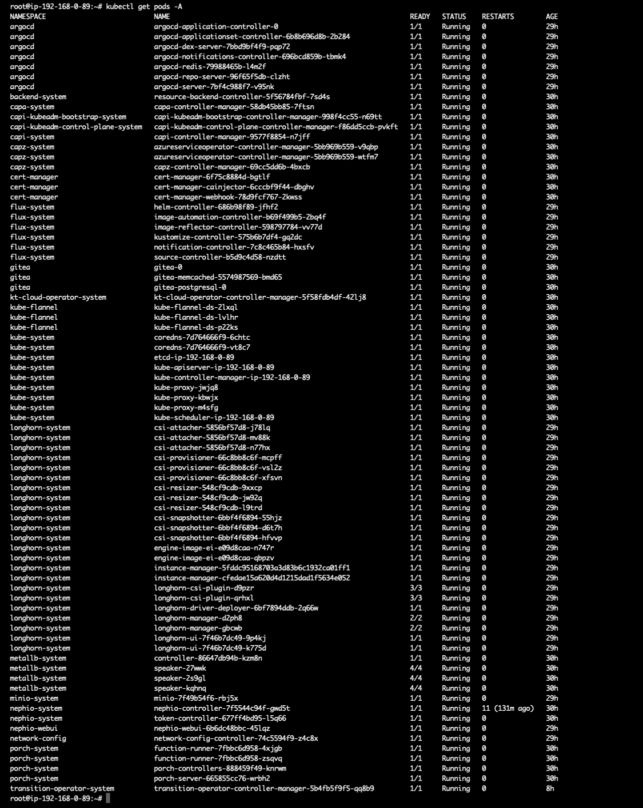
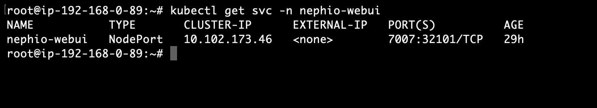
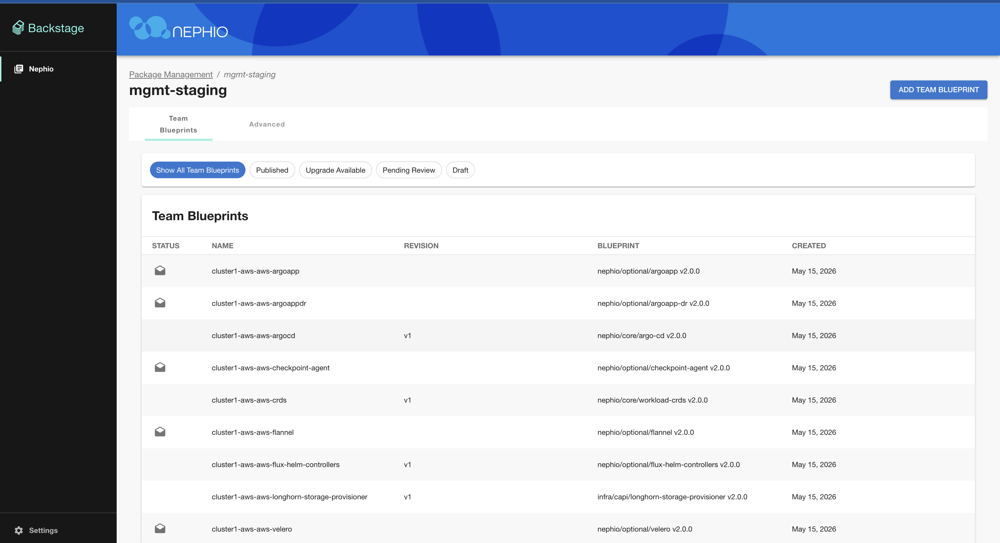
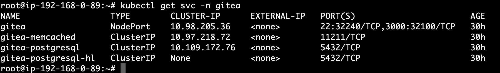
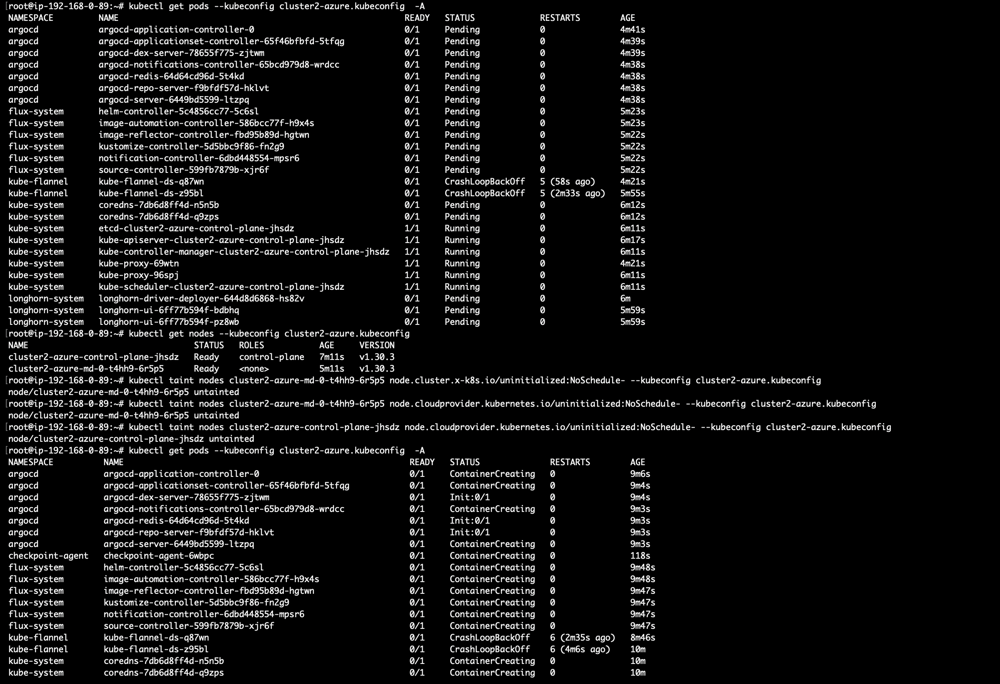
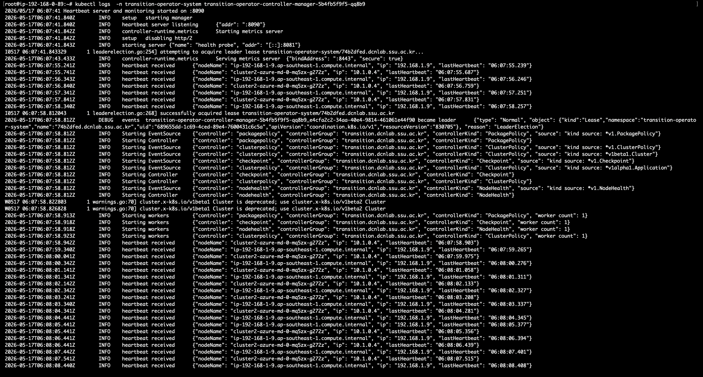
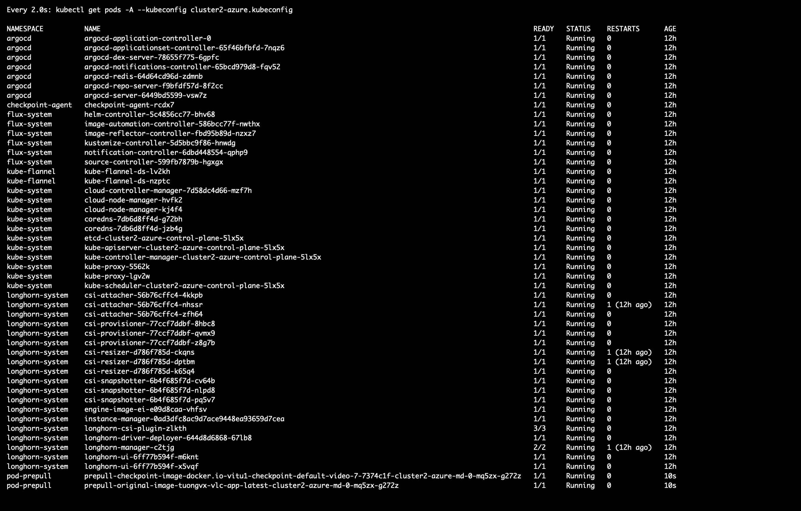

# Cluster Migration Guide

This guide provides a structured approach for migrating both stateless and stateful workloads across Kubernetes clusters. The migration mechanism leverages container checkpointing, a management-plane migration operator, and a node-level checkpoint agent to capture and restore running application state.

The guide is organized into two main parts:

1. **Installation and Infrastructure Setup** — covers environment prerequisites, cluster preparation, operator deployment, and storage and network configuration.
2. **Testing Procedures** — demonstrates how to trigger a migration, verify checkpoint and restore steps, and evaluate service continuity during failover or planned transitions.

---

## Part I: Installation and Infrastructure Setup

### 1. Overview

- The management plane runs controllers on the management cluster.
- The workload plane runs the checkpoint agent on source worker nodes.
- Storage and network configuration must match between source and target clusters for successful restoration.

> **Important:** Source and destination clusters must run identical versions of kubelet, containerd, CRIU, and runc.
> This guide was validated between AWS and Azure public clouds, but the procedure should apply similarly to other cloud providers.

---

### 2. Prerequisites

- Kubernetes >= 1.30 on all clusters 
- containerd >= 2.1.4 on all nodes (pre-installed)
- CRIU >= 4.1.1 on worker nodes (pre-installed)
- runc — exact same version across all nodes (pre-installed)
- Go >= 1.23 on all relevant hosts (pre-installed)
- Helm installed on the management cluster (pre-installed)
- `clusterctl` available on the management cluster (pre-installed)
- Access to a container registry with credentials
- Access to a Git server for package sources (e.g., Gitea)
- Access to a MinIO or S3-compatible object store for checkpoints

---

### 3. Cluster Management and Installation

#### A. Management Cluster

The management cluster is configured through Ansible. Ansible playbooks run on the local machine using pre-configured AWS and Azure environment variables to provision the core cloud infrastructure required to bootstrap clusters.

The following dependencies are required on the local machine:

- `ansible` [core 2.17.7]
- `python3.10/site-packages/ansible`
- Jinja version 3.1.6

**Steps:**

1. Set up Ansible as described in [these docs](https://github.com/vitu-mafeni/nephio-test-infra-aws/blob/master/docs/pre-setup.md).
2. Clone [this repository](https://github.com/vitu-mafeni/nephio-test-infra-aws.git) and navigate to `e2e/provision`:
3. Set the Azure, Gitea, and Docker Hub environment variables in `e2e/provision/set-env`, then run:

```bash
source set-env
./install-sandbox.sh
```

After approximately 40 minutes, the management cluster will be created. The transition operator will be running in the `transition-operator-system` namespace with all configurations already applied by the Ansible playbooks. All other pods should also be in a running state. Verify with:

```bash
kubectl get pods -A
```



Once the management cluster is up and fully running, you can proceed to create workload clusters through the UI. First, retrieve the NodePort service for the web UI and access it in a browser:

```bash
kubectl get svc -n nephio-webui
```



---

##### Cloud Setup on the Management Cluster (Azure Example)

Install the Azure CLI:

```bash
curl -sL https://aka.ms/InstallAzureCLIDeb | bash
```

Log in:

```bash
az login
```

Create a resource group:

```bash
az group create --location koreasouth --resource-group capi-test
```

Create a user-assigned identity:

```bash
az identity create \
  --name cloud-provider-user-identity \
  --resource-group capi-test
```

---

#### B. Workload Clusters

Follow the workload cluster creation steps described [here](https://github.com/vitu-mafeni/nephio-test-infra-aws/blob/company-version/bootstrap_5g_guide.md#create-workload-clusters).

> **Note:** The linked guide reflects the prior version without the transitioning feature integrated. The steps are the same, but the packages differ as described below.

After creating the clusters, new package drafts will appear in the `mgmt-staging` repository. These packages require environment variables to be configured for both clusters (AWS and Azure):

- `<cluster-name>-argoapp`
- `<cluster-name>-argoappdr`
- `<cluster-name>-checkpoint-agent`
- `<cluster-name>-flannel`



> **Tip:** Packages may take time to be approved by the auto-approval controller. If they appear frozen, restart the Porch and Nephio controllers:
>
> ```bash
> kubectl -n porch-system rollout restart deploy porch-server
> kubectl -n nephio-system rollout restart deploy nephio-controller
> ```

**Configuring the packages:**

- **argoapp / argoappdr:** Edit both cluster packages, find the `StarlarkRun` CR, and set the Git server URL to the NodePort of the Gitea service running on the management cluster:

  ```bash
  kubectl get svc -n gitea
  ```

  

- **checkpoint-agent:** Edit the `DaemonSet` and populate the following environment variables:
  - `CHECKPOINT_DIR`
  - `MINIO_ENDPOINT`
  - `MINIO_BUCKET`
  - `PULL_INTERVAL`
  - `CONTROLLER_URL`
  - `AWS_REGION` *(omit or leave empty for non-AWS clusters)*
  - `POD_NAMESPACE`
  - `MINIO_ACCESS_KEY`
  - `MINIO_SECRET_KEY`

- **flannel:** Edit the `kube-flannel-cfg` ConfigMap and add the Pod CIDR to match the target cluster's network range.

**Configuring the AWS package (mgmt repository):**

Navigate to the AWS package and edit the following CRs:

- `AWSCluster` — set VPC, public and private subnets, and security groups
- `AWSMachineTemplate` — instance type (e.g., `t3.xlarge`)
- `Cluster` — set `clusterNetwork.pods.cidrBlocks`

**Configuring the Azure package:**

Edit the following CRs:

- `AzureClusterIdentity` — set `clientID`, `tenantID`, and `clientSecret`
- `AzureCluster` — set `subscriptionID`
- `AzureMachineTemplate` — set all required fields (e.g., `Standard_D4s_v3`)
- `Secret` — rename by replacing the word `example` with the actual cluster name and update the secret values

In the `<cluster>-repo` package in the mgmt repository, edit the `StarlarkRun` file and set the Git server URL using the Gitea NodePort service.

For Azure clusters, replace all occurrences of `example` with the actual cluster name (e.g., `cluster1-azure`):


Set all environment variables to match your cloud account (Azure or AWS). Keep provider-specific CIDRs and network settings consistent with your cloud resources.

**Retrieve kubeconfig files** for both clusters from the management cluster:

```bash
clusterctl get kubeconfig <cluster-name> > <output-path>.kubeconfig
```

After the Azure cluster is created, pods may be stuck in a `Pending` state due to uninitialized taints. Remove them with:

```bash
kubectl get nodes --kubeconfig <location>.kubeconfig
kubectl taint nodes <worker-node> node.cluster.x-k8s.io/uninitialized:NoSchedule- --kubeconfig <location>.kubeconfig
kubectl taint nodes <worker-node> node.cloudprovider.kubernetes.io/uninitialized:NoSchedule- --kubeconfig <location>.kubeconfig
kubectl taint nodes <control-plane-node> node.cloudprovider.kubernetes.io/uninitialized:NoSchedule- --kubeconfig <location>.kubeconfig
```



---

### 4. SSH and Access (Optional Helpers)

To copy SSH keys from the `capi` user to root:

```bash
cp -r /home/capi/.ssh /root/
```

Enable root SSH by setting `PermitRootLogin yes` in `/etc/ssh/sshd_config`, then restart the SSH service:

```bash
systemctl restart ssh || service sshd restart
```

Example VS Code SSH config for a bastion-proxied Azure node:

```
Host azure-bastion-box
    HostName 20.214.25.226
    User capi
    IdentityFile "C:\\Users\\Vt\\Downloads\\azure-vm-test_key.pem"

Host azure-target-box
    HostName 10.1.0.4
    User root
    IdentityFile "C:\\Users\\Vt\\Downloads\\azure-vm-test_key.pem"
    ProxyCommand ssh -q -W %h:%p azure-bastion-box
```

---

### 5. ClusterPolicy Configuration

#### Deploy the Sample Video Application

Add the video application to the catalog:


Controller annotations used to discover packages:


Port-forward the video service from the AWS or Azure cluster:

```bash
kubectl port-forward svc/video-service --address 0.0.0.0 30080:8080 --kubeconfig aws.kubeconfig
```

---

#### Apply the ClusterPolicy

Update the values below to match your environment, then apply the resource to the management cluster. This example migrates an application from AWS to Azure:

```bash
cat > /tmp/cluster-policy.yaml <<'EOF'
apiVersion: transition.dcnlab.ssu.ac.kr/v1
kind: ClusterPolicy
metadata:
  name: clusterpolicy-sample
spec:
  clusterSelector:
    name: cluster1-azure
    repo: http://3.0.52.147:30782/nephio/cluster1-aws.git # repo where the cluster workloads are defined
    repoType: git
  packageSelectors:
    - name: video
      packagePath: video
      packageType: Stateful # Stateless or Stateful
      liveStatePackage: true
      backupInformation:
        - name: my-test-backup
          backupType: Schedule # Manual or Schedule
          schedulePeriod: "*/2 * * * *" # cron format
    - name: redis
      packagePath: redis
      packageType: Stateful
      liveStatePackage: true
      backupInformation:
        - name: my-test-backup1
          backupType: Schedule
          schedulePeriod: "*/2 * * * *"
  targetClusterPolicy:
    preferClusters:
      - name: cluster2-azure
        repoType: git
        weight: 100
EOF

kubectl apply -f /tmp/cluster-policy.yaml
```

After applying the ClusterPolicy, the transition operator logs will show workload clusters sending heartbeats, the operator taking checkpoints, and pre-pulling checkpointed workloads onto the target clusters:

```bash
kubectl logs -n transition-operator-system <pod-name>
```

- Heartbeats:

  

- Workload checkpointing, build, and pre-pull:

  

---

## Appendix

### A.1 Notes and Best Practices

- Run all commands and services with root privileges.
- Keep all software versions identical between source and destination nodes.
- Validate Pod CIDR consistency between CAPI resources and your CNI configuration.

### A.2 Troubleshooting

| Symptom | Resolution |
|---|---|
| Flannel not routing pods across nodes | Verify Pod CIDR alignment and ensure cloud-controller integration is working on Azure. |
| Checkpoint restore fails | Confirm CRIU and runc version compatibility. Review `/tmp/criu.log` on the node. |
| Agent cannot reach MinIO | Verify `MINIO_ENDPOINT` and network policy. Confirm the bucket exists and credentials are correct. |
| Controller cannot access Git or registry | Validate secrets, network egress rules, and DNS resolution. |
| Feature gate ignored | Ensure the kubelet flag is placed in the correct location for your distribution and that systemd drop-ins are not overriding it. |

---

## Part II: Testing Procedures

### 6. Fault Injection and Recovery

All test scripts are located in the `test-scripts/` folder. Clone the repository on the management cluster:

```bash
git clone https://github.com/vitu-mafeni/transition-operator.git -b company-version
```

---

#### 6.1 CNI Fault Injection

On the **worker node**, remove the CNI interface to simulate a network fault:

```bash
sudo ip link delete cni0
```

The controller runs a dummy pod on the control node and pings a randomly selected pod on the worker node. If the ping fails, the fault is detected and the workload is migrated to the target cluster.

---

#### 6.2 CNI Recovery Procedure

**Step 1 — On the worker node:**

1. Stop kubelet to prevent race conditions:

   ```bash
   sudo systemctl stop kubelet
   ```

2. Clean up CNI and kubelet state:

   ```bash
   sudo rm -rf /var/lib/cni/*
   sudo rm -rf /var/run/flannel/*
   sudo rm -rf /var/lib/kubelet/pods/*
   sudo rm -rf /opt/cni/bin/flannel.lock 2>/dev/null || true
   ```

3. Restart services:

   ```bash
   sudo systemctl restart containerd
   sudo systemctl start kubelet
   ```

**Step 2 — From the management cluster:**

Using the target cluster's kubeconfig (e.g., `xazure2.kubeconfig`), restart all pods in every namespace:

```bash
for ns in $(kubectl get ns --no-headers -o custom-columns=":metadata.name" --kubeconfig xazure2.kubeconfig); do
  echo "Restarting all pods in namespace: $ns"
  kubectl delete pod --all -n $ns --kubeconfig xazure2.kubeconfig
done
```

---

#### 6.3 API Server Fault Injection

To simulate a control plane failure, stop the API server on the **source workload cluster control node**:

1. SSH into the control node:

   ```bash
   ssh <user>@<control-node-ip>
   ```

2. Navigate to the script directory and make the script executable:

   ```bash
   cd /path/to/your/script
   chmod +x stop-api-server.sh
   ```

3. Run the script:

   ```bash
   ./stop-api-server.sh
   ```

4. Verify that the API server has stopped:

   ```bash
   sudo systemctl status kube-apiserver
   ```

   Expected output:

   ```
   ● kube-apiserver.service - Kubernetes API Server
      Loaded: loaded (/etc/systemd/system/kube-apiserver.service; disabled)
      Active: inactive (dead)
   ```

---

### 7. Application Readiness and Recovery Measurement

To measure application readiness and recovery time after a fault:

1. Create an `apps-config.yaml` file with the following content:

   ```yaml
   - namespace: default
     label: app=redis
     app_url: 192.168.1.203
     app_port: 30081
     app_type: redis

   - namespace: default
     label: app=video
     app_url: 192.168.1.203
     app_port: 30080
     app_type: http
   ```

2. Run the measurement script:

   ```bash
   python3 measurement.py --apps-config apps-config.yaml
   ```

The script monitors application readiness and records the time taken to recover after each fault.
